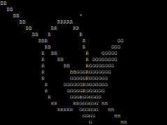
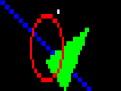

# Machine Oriented Programming Course Project: _Agra_

## Brief introduction

Library provides an easy to use functions that have powerful and fast implementation. All key elements are written in pure ARM Assembly, so performance must be on the top. Agra provides range of 2D primitives to be drawn in different modes as well different console outputs to see result of work.

## Main functionality:

_Agra_ provides functions that can be easily used in C.

Initialization is done with just one function call

```cpp
int InitBuffer(int width, int height, int o_mode)
```

It will dynamically allocate frame buffer memory and setup all needed default values for brush and output mode. Returns _0_ if initialization went as it supposed to be, and _1_ if error occurred. With all initialization done, library is ready to be used.

Library is cable of represent basic 2d primitive shapes on canvas, and rendering them to console in different modes.
To manipulate in which color and how each pixel will be drawn on canvas there are 2 functions:

```cpp
void setPixColor( pixcolor_t * color_op );

void setDrawMode( int drawMode );
```

To clear frame from anything that was there before, _ClearScreen_ function must be called, it will fill entire frame buffer memory with _0_.

So main functions that are used for actual drawing have following signature:

```cpp
int pixel(int x, int y, pixcolor_t * colorop);

void line(int x1, int y1, int x2, int y2);

void triangleFill(int x1, int y1, int x2, int y2, int x3, int y3);

void circle(int x1, int y1, int radius);
```

All of them are made with help of optimal algorithms and written pure Asm for speed purpose.

- Line function uses [Bresenham's line algorithm](https://en.wikipedia.org/wiki/Bresenham%27s_line_algorithm), it provides accurate line approximation with small error.
- Filled Triangle function was used approach of calculating rectangle where current triangle lives, and then iterating over all rectangle pixels, check whenever it is inside a triangle or not.
- Circle function uses same [Bresenham's line algorithm](https://en.wikipedia.org/wiki/Bresenham%27s_line_algorithm) but with small modification to approximate circle.

When any of drawing function is called ( such as _circle_, _line_, etc. ) in the end it eventually will become a call of _pixel_ function. So all the magic of bleeding and adding up colors values depending on drawing mode will happen here.

Library contains brush with its specific color value and drawing mode. So each pixel color is represented with following struct:

```cpp
typedef struct {
    unsigned int r  : 10;
    unsigned int g  : 10;
    unsigned int b  : 10;
    unsigned int op : 2;
} pixcolor_t;
```

and brush drawing modes by:

```cpp
typedef enum {
    PIXEL_COPY = 0,
    PIXEL_AND  = 1,
    PIXEL_OR   = 2,
    PIXEL_XOR  = 3,
    PIXEL_ADD  = 4
} pixop_t;
```

As it can be seen from the code that red, green and blue channels are represented by 10 bits unsigned integers which mean that values of **these fields are in range [0, 1023]**, so white color would look like (1023, 1023, 1023), not (255, 255, 255). And functionality of _op_ field was changed to describe color's opacity ( Alpha channel ) with value range [0, 3]. Because there were only 2 that were dedicated for alpha channel principle of its work is a bit different, **rc >> (6 - ( op \* 2 ))** is formula for calculating real color value, so for example: if we have white color with full opacity ( _op=1_ ) than real color of this pixel will be **1023 >> ( 6 - 2 )** which will become (63, 63, 63).

Default drawing mode is set to _0_ ( PIXEL_COPY ), in other words it means that it will ignore already existing color and will just write it over with new one. Others modes are used for different types of bleeding and work in the way that it will use it chosen logical operator ( AND, OR, XOR, etc. ) over old and new color.

When all drawing all done and frame is ready to be rendered, function: _FrameShow_ is used:

```cpp
int FrameShow()

typedef enum {
    OUT_CHAR = 0,
    OUT_RGB  = 1
} out_t;
```

Library is capable to render frame to console in 2 different ways, first is character: all pixels colors are mapped to it corresponding character ( 'R' - dominating red, 'G' - dominating green, 'C' - dominating red and blue, ' ' - black , '\*' - white etc. ) and all of them will be placed at their corresponding place. Second method uses escape characters to deliver understandable colorful rgb image. ( Output mode is defined in buffer initialization )

Because _Agra_ was developed with Assembly and C languages there are no objects and all memorythat was dynamically allocated ( in buffer initialization ) must be released, so in the end of program should be called:

```cpp
void FreeBuffer();
```

Function will release all dynamically allocated memory that was used by _Agra_, thus preventing any errors that may occur.

## Example screenshots:

 

## Problems during development

Most exiting and challenging in this project of course was writing assembly code because due to lack of knowledge in very specific cases, development stuck completely for days because of one small mistakes, it usually take huge amount of time to trace them and understand who are rising them and how to fix it. As well, I never done anything similar to this in the past, so it was difficult to get everything to work together is such _big_ project.

## What i would change

In general i would tweak a little project structure ( used different color representation, used different functions, etc. ) it was hard to be on the way that was strictly defined in documentation, things must be done in the way they were described, but i would give a little more freedom and ability to choose what to do.

### Project was developed within _University of Latvia MOP Course_ studies under supervision of Leo Seļāvo

#### [Project documentation.](http://selavo.lv/wiki/index.php/LU-MOP-KP)
